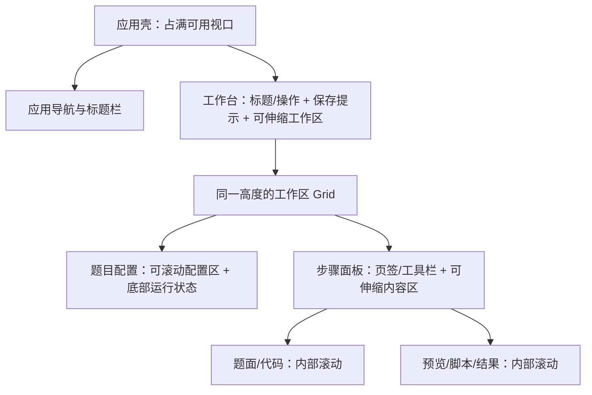

# Setdraft Rev0.4 联合分析与修复方案

日期：2026-10-01（Asia/Shanghai）。版本定位：**判题与数据一致性修复、执行恢复、搜索可诊断、响应式制题工作台与聊天界面**。

本文合并用户四项反馈、部署实测，以及《Setdraft Rev0.3 全面复审：功能、数据一致性、执行与架构》。这是下一版的实施方案；本文中的目标行为和验收门槛尚未实现，不能当作修复结果。

## 1. 基线、范围与证据口径

- 审计冻结 SHA：`da9ca6f0303bdebafb6ba31715fd905c8e8282af`。本地 HEAD、`Rev0.3` 和本轮只读远端标签核对一致；下一标签建议为 `Rev0.4`。
- 现场地址：<http://10.11.149.225:4321>。通过现有登录会话访问；只切换页面、测量布局，并主动运行了一次管理员 SearXNG 连接测试。
- 审计报告来源：[用户提供的第三方报告](</Users/albert_li/Downloads/Setdraft-Rev0.3-comprehensive-review-2026-10-01.md>)。报告中的建议和临时脚本命令作为审查材料，没有直接执行其外部脚本。
- 当前工作区另有已完成的 Playwright、共享 Markdown 和默认关闭 OpenTelemetry 改造，尚未提交/发布。Rev0.4 应在保留这些改造的基础上修复，避免覆盖当前工作区。
- 保留单体、PostgreSQL、现有本地文件、队列、ReactMarkdown 与 Typst/cmarker。保留既定监听地址和部署拓扑；OSS、外部消息队列、独立监控栈与多 Web 实例不在本版范围。

证据分为三类：**现场复现**、**本轮隔离执行/源码复核**、**第三方复现待补真实边界**。第三方报告的 25 组为 2 组 P1、21 组 P2、2 组 P3，不等于 25 起线上事故。本文继续使用原 ID，不重复计算同一根因。

## 2. 联合分析：已经确认什么

### 2.1 用户反馈的现场测量

| 用户反馈 | 本轮结果 | 根因或待核实边界 |
| --- | --- | --- |
| SearXNG 无可用结果 | 管理员 `POST /api/ai/search` 约 8057 ms 后返回 502，复现用户原文 | 对照当前实现，这一说明对应解析后的可用结果为零且存在 `unresponsive_engines`。具体哪些引擎超时/触发验证，当前接口没有暴露，尚不能从这句提示确定 |
| 全屏工作台太窄 | 1920、2560、3008、3440 CSS 像素视口下，主容器仍为 1280，内容仍为 1200，题面单栏约 453 | `.page` 统一限宽；工作台继承了阅读型页面的内容宽度 |
| 编辑区底部与运行状态不齐 | 1920×1080 下，左侧底边约 1319；题面约 916、Gen 约 1131、程序约 1073、验证/发布约 843 | 网格 `align-items:start`；题面/普通 tab 使用不同固定最小高度；CodeMirror 又按自身距视口顶部减 64 来独立计算高度 |
| 竞赛列表对齐不好 | 当前部署无竞赛记录；标题左边为 507，空态文字为 495，错位 12 CSS 像素 | `.contest-list` 的负边距与空态段落没有采用同一内边距。有题目表格的各列还需隔离 fixture 验证，不能声称本轮已在现场检查过 |
| AI 对话宽度/UI | 宽屏正文及输入框内容宽度固定约 740；1920 下模型控件左边约 268、正文左边约 712 | 消息区、输入框、顶部工具栏各自计算宽度/边距；正文与输入框当前基本对齐，工具栏未共享相同边界 |

测量覆盖 390×844、768×1024、1024×768、1366×768、1920×1080、2560×1440、3008×1568、3440×1440 等视口。截图的物理像素不能直接等同 CSS 视口；适配以实际容器宽度为准，另测 DPR。

本轮使用实际部署的只读布局探针，结果为 `RED`；宽度利用率和左右底边差值可以在修复后重复测量。

### 2.2 审计核心结论的独立复核

本轮从当前源码抽取实际 DOMjudge `runScript`，编译仓库自带 testlib 的隔离 C++ checker，再执行原始本地 `checker_score` 函数，得到：

| Checker 结果 | 本地分数 | 当前 DOMjudge adapter | 应有结果 |
| --- | --- | --- | --- |
| 正确值，`ok score(100)`，exit 0 | 100 | 42 / AC | AC |
| 错误值，`ok score(0)`，exit 0 | 0 | **42 / AC** | WA 或在不支持该语义时明确拒绝导出 |
| 正确值，`points 1.0`，exit 7 | 100 | **43 / WA** | AC |
| `points 0.996`，exit 7 | **100** | 43 / WA | 仍为部分分，不能用于满分发布验证 |

因此 X01、X02 与当前代码一致，且已有本轮执行证据。该探针没有运行完整 DOMjudge 服务，也未替代目标站导入验收。

同时复核了 S01 的 snapshot/load/version 分离、S02 的先提交文件再生成 snapshot、U02 的先推进 `savedVersion` 再丢弃旧回执、U01/E07 的迟到回调、E04 的初次缺少 attempt token、E01/E02 的收尾分支、AI 最终正文/预算/SSE 解析以及维护入口。它们没有被前一轮新增的 E2E、Markdown 或埋点顺带修复。

本轮既有 `web-search.test.ts` **13/13 通过**。这证明已有缓存、过滤、超时、失败降级等测试仍通过；它不能证明当前部署的上游引擎健康，也不能证明下面新增修复已经完成。

### 2.3 对发布优先级的判断

1. **先防错误判题和覆盖数据**：X01/S01 为发布阻断项；S02/U01/U02 与它们一起先修，X02 同判定语义一起处理。
2. **随后修执行与恢复责任**：E01/E02/E03/S03，及原生 D02/D03。已有执行已结束、状态却未落盘，不能靠加埋点解决。
3. **AI 正文、重试与配置并发属于功能修复**：A01–A05/D01/E04/E05，应与聊天 UI 一起验收。
4. **搜索与响应式布局有独立工作包**：可先完成部署诊断；页面改造要采用同一布局规则，并保护上面修复后的保存和异步生命周期。

## 3. 修复工作包与明确选择

### A. 统一判定和导出契约：X01、X02、E06、X03

**判定结果先规范化，再由目标适配器映射。** 契约包含裁判结果类别、原始有效分数/比例、是否真正满分，以及裁判系统错误；分数显示与满分判断分离。

- 本地验证、普通/交互 DOMjudge adapter、FPS/QDUOJ SPJ 使用同一组协议 fixture。实现语言不同可以保留，但结果语义必须相同。
- `points 0.995/0.996/0.9999` 不得被 round 成满分；`points 1` 才作为该比例协议的满分。分数展示与固定目标 Hydro 的规则对齐；其 `points` 解析对真正满分单独判断，非满分向下取整。[固定 Hydro 判分实现](https://github.com/hydro-dev/Hydro/blob/816fc88c01fc53fa8a2cb2d2444624f91d3addfb/packages/hydrojudge/src/testlib.ts)
- DOMjudge 的满分映射 42、合法非满分映射 43；裁判故障保持系统错误。退出码、消息前缀及分数一起检查，拒绝无效/超范围/不一致结果。
- 对本地扩展 `score(n)` 明确写出支持范围；目标无法无损表达时，在导出前给出可操作的错误，不静默改判。
- 导出自检加入**错误数值、错误格式、满分、部分分、裁判故障**，预期结果由独立 fixture 指定，避免 adapter 与自检共用同一个错误 oracle。
- 在既有报告/导出 JSON 元数据中增加可选的判定和导出契约版本，不新增数据库表。受影响的历史验证报告标记为需重新验证，不能仅凭旧 `success=true` 继续作为新发布/竞赛选择的依据。缓存包含目标和导出契约版本；旧 adapter 缓存失效，新包通过自检后发布为新产物，原历史包保留并标明状态。
- FPS 按结构化栏目映射 input/output，description 保留完整原文。无法可靠分栏的历史单段题面采用明确的“输入/输出要求参见完整题面”说明，并在导出报告标注兼容策略；不编造输入输出规则，也不发出不可导入的空节点。固定目标 importer 必须实际接受两种 fixture。
- 原生 SPJ 对选手输出按 bundled testlib 行为处理开头一个 UTF-8 BOM，保留已有换行/空白规则；不扩大到标准答案的隐式改写。

主要入口：[domjudge-export.ts](</Users/albert_li/data/Code/Hydro Problem Make/pi-fork/packages/hydro-server/src/domjudge-export.ts>)、[manual-sandbox.ts](</Users/albert_li/data/Code/Hydro Problem Make/pi-fork/packages/hydro-server/src/manual-sandbox.ts>)、[legacy-exports.ts](</Users/albert_li/data/Code/Hydro Problem Make/pi-fork/packages/hydro-server/src/legacy-exports.ts>)。

### B. 版本化提交、文件集及前端操作归属：S01、S02、U01、U02、U03、E07、U04

**一份内容只由它自己的版本基线背书；异步结果只提交给它所属的会话。**

- S01 回退只 load 一次，检查该对象的 revision，并用它绑定的数据库 version 提交 CAS。禁止通过后续 load 换成较新版本。
- S01 复制从短源事务捕获一致的 `{project, version, fileEntries}`。文件暂存不占长事务；最终提交复核这个已捕获版本，跨工作区锁顺序固定。
- S02 明确选择**冲突拒绝**：同一 stem 的 `.out`、`.ans` 不可同时进入最终文件集。检查在文件索引/项目提交的同一事务内完成，失败不涨 revision。覆盖先传答案、最后传输入的顺序。需要改扩展名时采用显式替换/删除操作。
- 增加受损题目的读取/修复路径；一题异常不能让整张项目目录不可用。正常详情结构保持兼容，异常项目单独标记为无法读取并提供修复信息，不伪造正常 snapshot。
- U01 源码读取绑定原项目 ID、会话 generation、AbortSignal；读取完成再复核 scope，所有程序/Gen/validator/SPJ 导入统一走此接口。相同字段的新导入使旧导入失效。
- U02 只有相应保存回执被接受、或确实完成重基，才推进 savedVersion。采用了更高服务器 revision 后，本地补丁必须重新 flush 或进入明确冲突；不允许“dirty 但 flush 成功且零请求”。
- U03 重登先刷新活动项目 revision/测试点，再通过保留本地草稿的接受流程恢复编辑。提交结果未知的操作先核对服务器；竞赛初始加载等也监听认证恢复代际。
- E07 项目/聊天选择和创建统一遵循最新用户意图。关闭弹窗、离开页面、发送、新建或新选择均使旧导航回调失效。已创建题目的迟到响应只更新目录；不强制抢回工作台。
- U04 标签框保留原始字符串草稿，blur/提交时再解析；IME、逐字输入逗号/空格及切题都要验证。

主要入口：[project-history.ts](</Users/albert_li/data/Code/Hydro Problem Make/pi-fork/packages/hydro-server/src/project-history.ts>)、[manual-projects.ts](</Users/albert_li/data/Code/Hydro Problem Make/pi-fork/packages/hydro-server/src/manual-projects.ts>)、[project-session.ts](</Users/albert_li/data/Code/Hydro Problem Make/pi-fork/packages/hydro-web/src/project-session.ts>)、[App.tsx](</Users/albert_li/data/Code/Hydro Problem Make/pi-fork/packages/hydro-web/src/App.tsx>)、[ManualWorkspace.tsx](</Users/albert_li/data/Code/Hydro Problem Make/pi-fork/packages/hydro-web/src/ManualWorkspace.tsx>)。

### C. 执行结束、终态持久化及引用完整性：E01、E02、E03

- E01 将“业务执行完成”“终态/事件持久化完成”“资源清理确认”区分为独立职责。Task/Chat 共用小型 settle/reconcile 能力，保存待提交结果、attempt 及幂等终态，进行有界退避。
- 数据库暂不可写时，进程保留 pending-terminal 的恢复责任和受限内存结果；数据库可写后补交，不再次调用模型或运行已完成程序。能落盘的恢复元数据利用既有存储结构。
- 计算槽在确认工作停止后可释放；终态或 cleanup 尚未完成时，admission/恢复责任不能遗失。pending 数量有界、压力过大时拒绝新入队。
- 状态和完成事件同一事务提交；提交结果未知先读回核对，不能重复发完成事件。进程在无法落盘时退出，重启将未知执行标为 interrupted/结果待核对，不承诺恢复从未持久化的结果。
- E02 Docker CLI 的 `error`、异常 close、非正常信号同取消/超时一样进入容器确认。CLI 死亡不等于 daemon 中的命名容器停止。
- 无法确认移除时进入已有 cleanup-pending，保留 stage 及调度恢复责任；确认容器不存在后才清目录、释放相应占用。
- E03 竞赛提交在同一 workspace 事务锁内检查 release 存在；删除 release/整个项目在同一事务里检查竞赛引用并删除。关系不变量由领域提交方法保证，不由 route 先读后写保证。
- 原有 OTel 补记执行、结算、清理结果及等待时间；遥测关闭时这些恢复行为仍完整运行。

主要入口：[tasks.ts](</Users/albert_li/data/Code/Hydro Problem Make/pi-fork/packages/hydro-server/src/tasks.ts>)、[chat-requests.ts](</Users/albert_li/data/Code/Hydro Problem Make/pi-fork/packages/hydro-server/src/chat-requests.ts>)、[sandbox-runtime.ts](</Users/albert_li/data/Code/Hydro Problem Make/pi-fork/packages/hydro-server/src/sandbox-runtime.ts>)、[contests.ts](</Users/albert_li/data/Code/Hydro Problem Make/pi-fork/packages/hydro-server/src/contests.ts>)、[releases.ts](</Users/albert_li/data/Code/Hydro Problem Make/pi-fork/packages/hydro-server/src/releases.ts>)。

### D. 灾备及原生管理：S03、D02、D03

- 健康目标备份严格校验。恢复前保全现场与生成健康备份分开：损坏现场尽力保存，并记录缺失/损坏清单；目标健康时不要求损坏现场先通过健康备份校验。
- 受损现场留档明确标记为不可保证完整自动回滚，不能冒充健康回滚源；正常 backup 仍严格验证。
- 备份/恢复覆盖数据库引用的 blob 及历史回退依赖的 release/source manifest；可重建资源要有明确重建步骤。优先补现有恢复路径，不将断电持久性实验宣称为已经验证。
- 原生与 Compose 共用维护引擎，分别注入数据库维护连接和数据目录。原生不能无条件委托另一套 `.env.compose`。
- 数据库目标、维护工具和目录在停服前完成预检；输出脱敏的目标摘要，避免维护到另一实例。原生维护身份与业务受限身份的权限分开说明。
- 停止原生进程前核验 OS 创建标识及托管实例归属，记录启动指纹/进程组；旧 PID 仍存在但身份不符时不发信号。systemd/launchd 接管可后续演进，本版先补可验证的身份检查。

主要入口：[compose-maintenance.mjs](</Users/albert_li/data/Code/Hydro Problem Make/pi-fork/scripts/compose-maintenance.mjs>)、[hydro-local.mjs](</Users/albert_li/data/Code/Hydro Problem Make/pi-fork/scripts/hydro-local.mjs>)、[workspace-integrity.mjs](</Users/albert_li/data/Code/Hydro Problem Make/pi-fork/scripts/workspace-integrity.mjs>)。

### E. AI 流、上下文、取消与配置：A01–A05、D01、E04、E05

- A01 SSE 行解码保存 chunk 末尾的 CR，下一 chunk 再判断 CRLF；EOF 时处理单 CR，未以空行结束的事件不当作完整成功事件。测试所有分包点、逐字节 UTF-8、CR/LF/CRLF，以及 error/取消时 reader 收尾。[WHATWG SSE 行与事件解析规则](https://html.spec.whatwg.org/multipage/server-sent-events.html#parsing-an-event-stream)
- A02 保留 refusal 增量及最终原因，作为可见拒绝文本/标记保存，不生成空白成功消息。
- A03 delta 负责实时显示，成功 final.content 负责最终正文。处理非空 start 和只在 end/done 补全的块；网页最终状态、持久化内容及下一轮上下文一致。
- A04 输入裁剪与 adapter 输出限制使用同一预算定义，动态预留结构性余量和回答空间。空间不足先裁剪旧历史，仍不足则明确报错，不能静默变成 1 token。覆盖 1024/2048/4096/8192 窗口及协议最小输出限制。
- A05 在 client 返回值、存储及 done 事件增加可选终态原因/完整性元数据。length 显示“已保存，达到输出上限，内容不完整”；续写由用户主动发起。
- D01 本版选择**只允许重试没有后续消息的失败请求**。A 失败后已有 B，则 retry A 返回 409 并提示重新发送，不建立复杂上下文分支，也不悄悄使用 B 的历史。
- E04 首次发送即 `attemptId=requestId`，以后每次重试独立 token，Stop 始终携带对应 token。已重试的请求不接受未知轮次取消；旧客户端得到明确冲突/刷新提示，未重试的旧记录保留安全兼容路径。
- E05 在当前单实例约束下，串行化完整 catalog 读取/修改/持久化流程，覆盖新增、编辑、默认项、删除和清空；持久化失败不能先改内存。只把最终 write 串行化不够。
- 官方端点参数兼容和 Anthropic 提前终止后的 body cancel 作为同工作包的契约检查；第三方兼容端点保留可配置行为。

主要入口：[chat.ts](</Users/albert_li/data/Code/Hydro Problem Make/pi-fork/packages/hydro-server/src/chat.ts>)、[ai-configuration.ts](</Users/albert_li/data/Code/Hydro Problem Make/pi-fork/packages/hydro-server/src/ai-configuration.ts>)、[chat-request-lifecycle.ts](</Users/albert_li/data/Code/Hydro Problem Make/pi-fork/packages/hydro-web/src/chat-request-lifecycle.ts>)、`packages/ai` 的流适配器和预算模块。

## 4. SearXNG 修复方案（用户反馈 R01）

### 4.1 先查清请求失败在哪一层

当前源码已经配置 JSON、启用四个引擎、提供专用代理环境传递，并在测试连接时绕过缓存。不能把这些已有行为重复称为本版新增修复，也不能仅凭一条提示断言代理未配置。

诊断按以下顺序执行：

1. 核对部署 Web 与挂载的 SearXNG 配置版本、有效启用引擎及超时；只拉 Web 镜像并不能证明挂载配置已更新。
2. 从 Web 的实际运行网络发起 SearXNG JSON 请求；记录 HTTP 状态、响应格式、原始候选数量、接受数量及固定类别的过滤原因。
3. 读取 `unresponsive_engines`，逐引擎分类超时、验证、限流/挂起和其他故障；当前约 8 秒与配置的引擎超时一致，只是待验证线索。
4. 从搜索容器实际网络检查 DNS、TLS、上游连通及代理是否真正经过。`SETDRAFT_SEARCH_PROXY` 地址必须在容器可达；镜像下载代理与搜索出站代理分别核对。
5. 按当前部署网络选择可用引擎组合，至少用一条中文和一条英文公开查询验证真实结果；保留其他引擎作为实际可用的降级路径。

不得通过禁用 TLS 校验、移除结果安全过滤、伪造来源或静默改用付费服务来消除提示。延长超时只在实际慢响应得到证明后调整；它不能解决被阻断的网络或 CAPTCHA。

### 4.2 产品与部署修改

- 管理员页增加主动“运行诊断”：分层显示服务可达、有效引擎、成功/失败引擎类别、耗时、候选/接受计数及建议动作。可导出脱敏诊断 JSON。
- 诊断只对管理员可见，沿用调度限额，整体有界，不自动不断请求外网；健康状态标明最后检查时间。
- 将“配置就绪”与“真实搜索健康”区分。保留既有字段/接口兼容，增加诊断元数据；失败查询不能通过缓存结果假报健康。
- 分清无匹配结果、引擎全部不可用、返回结构异常及候选全部被过滤。有效 URL/标题但无摘要的结果要有明确接纳规则，若保留则显示“无摘要”，不编造摘要。
- 普通聊天展示短说明与“本次未使用网络资料”；管理员能展开详情。部分引擎失败但已有有效来源时继续正常回复。
- 升级脚本检查挂载配置是否发生变化，按需要重建 search；保留自定义代理/引擎设置，并输出脱敏配置版本摘要。
- 为现有搜索 span 补低基数失败类别和耗时，不把搜索词、代理凭据、原始上游错误放进遥测。

验收：接口与引擎诊断正确；中文/英文真实查询能返回有效来源；部分失败仍可用；全失败、超时、拒绝、无结果、过滤归零分别正确提示；更新镜像与配置后结果可复现。

参考：[SearXNG 出站网络与代理](https://docs.searxng.org/admin/settings/settings_outgoing.html)、[挂起时间与输出格式](https://docs.searxng.org/admin/settings/settings_search.html)、[搜索 API](https://docs.searxng.org/dev/search_api.html)。

## 5. 响应式工作台与编辑高度（用户反馈 R02）

### 5.1 页面采用三种布局职责

| 页面类型 | 规则 |
| --- | --- |
| 制题/程序工作台 | 填满应用内容区，左右 gutter 16–32 px 起；超宽屏可到 48 px。工作台外框不限 1280，预览正文内部可限制行长 |
| 竞赛/题目管理 | 统一宽版容器，侧栏与详情共用边界，表格有明确列宽和局部溢出规则 |
| 文档/设置 | 继续保留适合阅读和表单的内容宽度 |

用明确页面 modifier/布局容器选择职责，集中定义 gutter、面板间距、侧栏宽度和高度规则，清理重复覆盖。不要全局删除所有页面的 max-width。

### 5.2 推荐布局：共同工作区高度，面板内部滚动



- 桌面面板以父容器的剩余高度为唯一依据；左右外框同一 Grid 行、stretch，底边差值不超过 2 px。
- 左侧配置和附件区域内部滚动，运行状态位于侧栏底部；右侧工具栏占独立 auto 行，其余内容 `minmax(0,1fr)`。
- 题面、Gen、标准程序、第二程序、SPJ、validator、验证与发布采用同一外框高度。代码区填满分配空间，操作/帮助栏单独占行，不给每页再写一个固定高度。
- 移除 CodeMirror 的独立 `innerHeight - top - 64` 策略，保留实例/选区，随容器 resize 做必要测量；缩放、收起导航、提示条换行不应重建编辑器或丢内容。
- 编辑与预览宽度可调整，默认约 50:50；预览文章内部控制阅读行长，外框继续利用屏幕空间。
- 极低高度或移动端采用自然纵向流/单面板模式，避免强制等高造成不可访问控件。运行状态保持易于找到。

### 5.3 断点策略

以下容器宽度指扣除全局导航和 gutter 后的实际工作区，视口例子仅供理解：

| 实际容器宽度 | 典型视口 | 目标行为 |
| --- | --- | --- |
| ≥1100 px | 1440/1920/2560/3440 | 配置栏约 240–300 px，编辑/预览双栏；正文内部限制行长，代码充分占宽 |
| 800–1099 px | 1024/1366 或导航展开后的较窄面板 | 配置收为可访问抽屉；编辑/预览保持双栏，避免两套侧栏同时挤压 |
| <800 px | 768、手机、较高浏览器缩放 | 编辑/预览切换；配置抽屉；工具栏换行/更多菜单，表格和代码仅内部横向滚动 |

全局导航在平板/中等窗口采用收起/窄轨道，手机采用抽屉；自动适配不覆盖用户手动偏好。快捷按钮、取消/运行按钮、保存状态必须可访问。

## 6. 竞赛界面（用户反馈 R03）

- 先统一列表标题、普通项、选中项、空态文字的左边界，取消依赖负边距的空态布局。
- 页面标题、主操作、左列表、右详情使用同一 gutter；宽屏左右面板对齐，窄屏切为“列表 → 详情”，不把列强行压到无法阅读。
- 长竞赛名允许两行/省略并保留完整名称提示；题目数量、状态和操作放固定区域，避免名称长度改变操作位置。
- 赛事表单采用清晰 Grid 行列，label/输入/按钮基线统一；窄屏整组换行。
- 题目表格给题序、赛制、颜色和操作固定/可预测宽度，题名列伸缩；长标题不改变其他行的操作列位置。
- 空、加载、失败、删除后的历史项以及多条竞赛都使用同一对齐契约。历史与有效竞赛的区分保持明确。
- 排序/删除/加入版本修复后，刷新与认证恢复保持最新选择；同时落实 E03，不能只调整外观。

验收使用 0/1/20 条竞赛，长中文/英文标题、10+ 题、ACM/OI 混合、历史项、中文/英文界面以及窄屏；标题/行/操作列对应边界差值 ≤2 px。

## 7. AI 对话界面（用户反馈 R04）

- 顶部模型工具栏、消息、来源卡片、输入框统一使用一个聊天内容宽度变量和中心轴。
- 默认随窗口扩展至约 960–1120 px；提供代码“宽屏”视图至约 1360–1600 px，窄屏为可用宽度。普通段落内部保持约 72–90ch 行长，代码/表格可使用更宽区域并局部滚动。
- 输入区保持在消息区下方，只让消息区滚动；模型、联网开关、题目上下文、附件是清晰的独立控件，窄屏按组换行。
- 搜索失败放在对应回复附近的来源状态区，不以长错误文本持续挤占输入框；生成、排队、取消、失败可重试、拒绝及 length 截断分别展示。
- 最终全文与刷新后的全文一致；用户向上阅读时不强制拉回底部，有新内容提示；切会话恢复合理滚动位置。
- 保留代码高亮/复制、Markdown/math 和图片；校验长代码、宽表格、错误/来源展开后没有整页横向滚动。
- 与 A01–A05、D01/E04/E07 一起验收，避免宽度改好了但仍保存空白/缺字回复或切错会话。

## 8. 审计 25 组逐项验收矩阵

| ID | 等级 | 工作包 | 最小验收场景与正确结果 |
| --- | --- | --- | --- |
| X01 | P1 | A | 编译真实 checker，错误数值不能 AC，quitp 满分可 AC，裁判故障不伪装 WA；导出脚本独立自检 |
| S01 | P1 | B | 门控编辑与回退/复制交错，内容和版本为同一快照；过期提交 409，不得静默覆盖已成功保存内容 |
| S02 | P2 | B | in/out/ans 的不同上传顺序、批次与并发；冲突失败不改文件索引/revision，其他题仍可列出 |
| U01 | P2 | B | A 源码读途中切 B/重登/再次导入，旧读取不能写入 B；真实 API 检查 B 源码未改变 |
| U02 | P2 | B | PUT r2 回执晚于 GET r3；补丁再保存或明确冲突，导航不能假 flush 成功丢补丁 |
| S03 | P2 | D | 当前缺 blob、目标完整：可恢复目标；损坏现场留档可识别；正常健康回滚另行验证 |
| E01 | P2 | C | 注入连续终态写失败，DB 恢复后正确结算；完成事件幂等，队列容量不泄漏，不重复执行 |
| E02 | P2 | C | 专用沙箱杀 CLI、主动取消、超时；真实 daemon 中容器确认停止，清理失败保留 stage/责任 |
| E03 | P2 | C | 真实 PG 门控加入竞赛与删除版本/项目，最多合法一方成功，不留下悬空引用 |
| X02 | P2 | A | 0.995/0.996/0.9999 均非满分，1 为满分，百分数及边界语义按协议契约验证 |
| A01 | P2 | E | 合法 SSE 逐字节及所有分包点，CR/LF/CRLF、UTF-8、EOF 一致；reader 正确收尾 |
| A02 | P2 | E | 纯 refusal/混合正文可见且持久化，刷新后没有空成功消息 |
| A03 | P2 | E | 非空 start + delta，以及 end/done 才补全正文；最终、数据库、下一轮上下文全文相同 |
| A04 | P2 | E | 小窗口短输入保留合理输出上限，不静默变 1/16；真实请求构造符合共享预算 |
| A05 | P2 | E | length 标记持久化，刷新仍显示不完整；不自动发付费续写 |
| D01 | P2 | E | A 失败→B 完成→retry A：409，模型不被再次调用；尾部失败请求仍可重试 |
| E04 | P2 | E | 双标签延迟旧 Stop 到新 attempt，旧取消不能终止新重试，初次 token 接线受测 |
| E05 | P2 | E | 并发新增/修改/默认/删除配置不会双成功丢更新；存储失败内存状态不抢先变化 |
| E06 | P2 | A | 新题与历史单段题面导出 FPS，固定目标 parser/serializer 实际接受，原文保持完整 |
| E07 | P2 | B | A 慢/B 快、关闭创建弹窗、导航离开、发送接管选择；迟到回执不夺回路由/聊天 |
| U03 | P2 | B | 提交响应认证中断→重登，活动题 revision/cases 与 API 一致，草稿仍保留，竞赛加载重试 |
| D02 | P2 | D | 仅原生配置可维护对应数据库/文件；预检失败发生在停服前，不接错 Compose 实例 |
| D03 | P2 | D | PID 存在但创建/实例指纹不符时零终止信号；正确托管进程仍能正常停止 |
| U04 | P3 | B | 逐字输入 `math,dp`、中文输入法、空格、粘贴、失焦及切题；标签不黏连/丢失 |
| X03 | P3 | A | bundled checker 与导出 SPJ 的 BOM/换行/空白差分结果一致 |

真实边界分配：数据库竞态用专用 PostgreSQL；容器生命周期用真实 Docker；用户操作归属用浏览器/API 双重断言；AI 用固定字节流与 faux 客户端，不用真实密钥或付费 API。目标 OJ 的 importer/verdict 契约检查与实际在线站点导入验收分别记录。

## 9. 浏览器适配与发布门禁

### 9.1 视口矩阵

至少覆盖 320×740、390×844、768×1024、1024×768、1280×720、1366×768、1440×900、1920×1080、2560×1440、3008×1568、3440×1440、3840×2160；关键尺寸分别测导航展开/收起，DPR 1/2，中文/英文。浏览器 125%/150% 缩放另作人工验证，不能仅用截图分辨率代替。

- 工作台宽屏利用可用空间，布局外框左右底边 ≤2 px；编辑器/预览内部滚动，不把关键控件藏在不可滚动祖先下。
- 320 起无意外整页横向滚动，长代码/表格在自己的区域滚动。
- 竞赛标题、空态与列表文字对齐，长名称不移动操作列。
- 聊天工具栏、来源、输入框共用中心轴；软键盘与 safe-area 下输入和发送/停止可访问。
- 断点切换、导航收起、提示条变高不丢选区、草稿或未完成状态。

### 9.2 CI 分层

- 每个工作包先有能捕获对应缺陷的回归，再修复；提交时跑定向测试与 `npm run check`。
- PR 核心浏览器测试增加保存回执竞态、源码导入切题、旧 Stop、新旧会话选择和代表性响应式断言。
- 密集尺寸矩阵采用隔离确定性 fixture；截图作为辅助证据，核心门槛是几何/可访问性/真实数据断言。固定浏览器、字体、动画策略后再建立稳定截图基线。
- main/标签发布前完整门禁补真实 checker 协议、容器异常退出、PG 并发、恢复演练和打包/PDF；保留已有测试，不以旧用例通过替代新增场景。
- SearXNG 外网验收独立记录查询时间、部署配置版本和真实结果。确定性 CI 测试检查诊断/代理/配置及替身上游故障；外网波动不应让每个 PR 不稳定，也不能被写成“外网搜索已经验收”。
- 历史记录仍可读取并明确显示状态；已生成的错误目标导出包不自动改写。版本说明提示受 X01/X02/E06/X03 影响的包须重新验证/导出；缺少新契约版本的受影响报告不能被当成新门禁通过，重新验证和重新导出分别验收，避免继续复用旧成功标记或缓存包。

## 10. 实施顺序与交付

| 顺序 | 交付 | 完成门槛 |
| --- | --- | --- |
| M0 | 固定基线、复现夹具、逐项责任清单 | 25 ID 与 R01–R04 有对应场景，保留此前三项升级工作区 |
| M1 | A + B 的高优先修复 | X01/S01/S02/U01/U02 通过真实边界；X02 与判定一起完成 |
| M2 | C + D | 终态恢复、容器确认、引用原子性、健康目标恢复、原生维护身份通过 |
| M3 | E | 流全文/拒绝/截断/预算、历史重试、attempt 与配置并发通过 |
| M4 | 搜索 + 响应式工作台/竞赛/聊天 | 搜索现场验收与尺寸矩阵通过；搜索排查可先于页面改造开展 |
| M5 | Rev0.4 发布验收 | 全部正式修复项有结论，完整门禁、生产构建、镜像和部署验收结果可核对 |

每个工作包独立评审，最终在同一 Rev0.4 发布前综合验收。若某目标兼容性未完成，发布说明必须明确其状态及产品入口行为，不能宣称该目标已修复。

交付内容：修复代码与精确依赖、回归 fixture、诊断配置说明、响应式布局规则、部署/恢复文档、受影响历史导出处理说明，以及带实际命令、commit、CI 运行、镜像 digest 和现场结果的 Rev0.4 验收报告。

## 11. 后续验证项与本轮材料

报告中未升级为正式缺陷的内容保留为验证队列：损坏 blob 重传、文件 fsync/恢复 journal、历史源目录重建、图片和事件字节背压、空闲轮询/列表摘要、会话撤销提交语义、临时磁盘总额、交互 RE/WA 分类。先测相应边界；不因“可能”将它们计入正式漏洞数，也不为本轮立即重写存储或调度架构。

本轮证据位于 [实测材料目录](</Users/albert_li/data/Code/Hydro Problem Make/pi-fork/output/rev0.4-plan-2026-10-01>)：

- `layout-probe.js` 与 `layout-metrics.json`：实际部署 8 组视口及 5 个步骤页，预期缺陷判定为 RED。
- `chat-metrics.json`、`contest-metrics.json`：宽度/边界实测，不含聊天正文或凭据。
- `search-probe.json`：现场搜索 502、耗时及错误说明。
- `checker-probe.mjs` 与 `checker-probe.json`：实际 bundled testlib、原 adapter 和原本地解析函数的独立执行结果。

判定探针复跑命令：

```sh
node output/rev0.4-plan-2026-10-01/checker-probe.mjs
```

布局探针需要已登录、打开题目的 Playwright page，通过 `browser_run_code_unsafe` 加载对应绝对脚本路径复跑，不写题目内容。搜索复现命令为管理员页“联网搜索 → 测试连接”。

此前三项升级的本地验收见 [验收记录](upgrades-acceptance-2026-10-01.md)，测试命令见 [测试说明](testing.md)。前一轮完整 E2E 10/10 是已有链路基线，尚未覆盖本文所有并发/故障场景，不代表 Rev0.4 正式修复验收完成。
